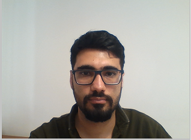

# Selfie Segemntation
this app can run in real-time on both smartphones and laptops.

## Install requirements

```bash
pip install -r .\requirements.txt
```

## input
The input image is the webcam frame.



## output
The output segmentation mask, which has the same dimension as the input image.


## Resources
```bash
Google AI Blog: Background Features in Google Meet, Powered by Web ML
ML Kit Selfie Segmentation API
Models and model cards
Web demo
Python Colab
```
